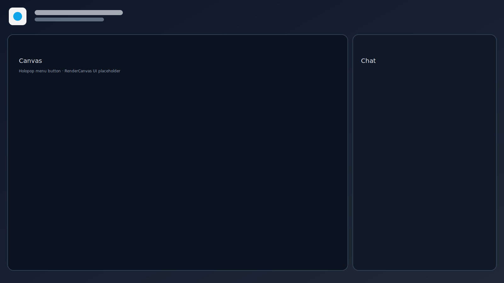

# RenderCanvas (Nano Banana Pro)

RenderCanvas (Nano Banana Pro) is an open-source, Holopop-branded AIGC creative canvas for rapid visual iteration.

## Screenshot



## Features

### Implemented
- **Canvas**: infinite canvas, select/move/zoom, basic shapes, text, pen, undo/redo.
- **Assets**: drag & drop images, upload/import images.
- **Chat**: right-side chat panel.
- **Image tools**:
  - Zoom preview (UI-only)
  - Crop (front-end UI)
  - Extend/outpaint (mock)
  - Upscale (mock)
  - Layers (lock/visibility)
- **Export**: PNG/SVG/JSON via built-in export dialogs.

### UI-only / Mock
- **Image tools**:
  - Remove background (UI-only)
  - Erase (UI-only)
  - Edit element (UI-only)
  - Edit text (UI-only)
- **Generators**:
  - Image generation (UI-only)
  - Video generation (UI-only)

## Quick start

```bash
# install dependencies
yarn install

# start the app (ChatCanvas UI)
yarn start
# open http://localhost:3000/?ui=chatcanvas
```

## Build

```bash
yarn build
yarn build:preview
```

## Backend API placeholders (mock)

> The current front-end ships with mock adapters only. The endpoints below describe the intended contract.

### POST `/api/image/remove-bg`
**Request**
```json
{
  "fileId": "file-123",
  "prompt": "optional description",
  "options": {}
}
```
**Response (mock)**
```json
{
  "jobId": "remove-bg-file-123",
  "status": "completed",
  "outputFileId": "file-123-removed-bg",
  "message": "Mock remove background complete."
}
```

### POST `/api/image/erase`
**Request**
```json
{
  "fileId": "file-123",
  "options": {"mask": "base64"}
}
```
**Response (mock)**
```json
{
  "jobId": "erase-file-123",
  "status": "completed",
  "outputFileId": "file-123-erased"
}
```

### POST `/api/image/outpaint`
**Request**
```json
{
  "fileId": "file-123",
  "options": {"direction": "right"}
}
```
**Response (mock)**
```json
{
  "jobId": "outpaint-file-123",
  "status": "completed",
  "outputFileId": "file-123-outpaint"
}
```

### POST `/api/image/crop`
**Request**
```json
{
  "fileId": "file-123",
  "options": {"x": 0, "y": 0, "width": 512, "height": 512}
}
```
**Response (mock)**
```json
{
  "jobId": "crop-file-123",
  "status": "completed",
  "outputFileId": "file-123-crop"
}
```

### POST `/api/image/upscale`
**Request**
```json
{
  "fileId": "file-123",
  "options": {"scale": 2}
}
```
**Response (mock)**
```json
{
  "jobId": "upscale-file-123",
  "status": "completed",
  "outputFileId": "file-123-upscale"
}
```

### POST `/api/generate/image`
**Request**
```json
{
  "prompt": "a neon city skyline",
  "negativePrompt": "low-res",
  "options": {"steps": 30}
}
```
**Response (mock)**
```json
{
  "jobId": "image-gen-a-neon-city-skyline",
  "status": "completed",
  "outputUrls": ["https://example.com/mock-image.png"]
}
```

### POST `/api/generate/video`
**Request**
```json
{
  "prompt": "a cinematic drone shot",
  "options": {"duration": 4}
}
```
**Response (mock)**
```json
{
  "jobId": "video-gen-a-cinematic-drone-shot",
  "status": "completed",
  "outputUrls": ["https://example.com/mock-video.mp4"]
}
```

## License & NOTICE

RenderCanvas (Nano Banana Pro) is distributed under the MIT License. See `LICENSE` and `NOTICE` for attribution details.
